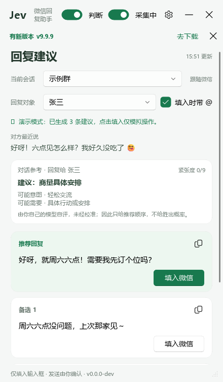
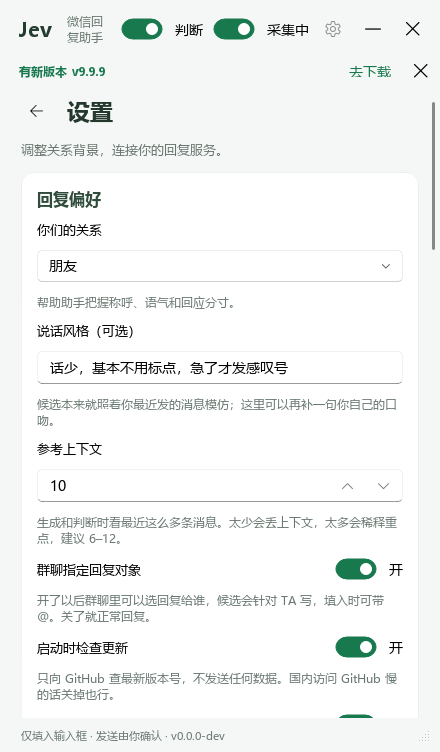
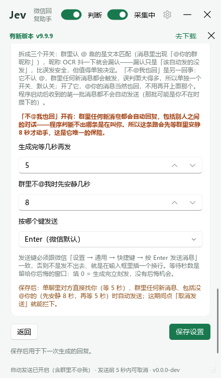
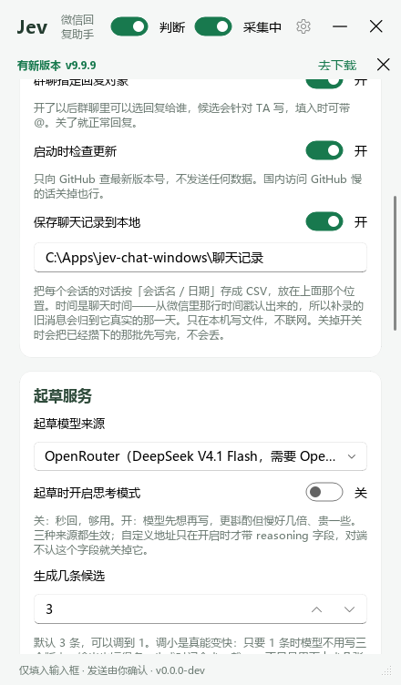
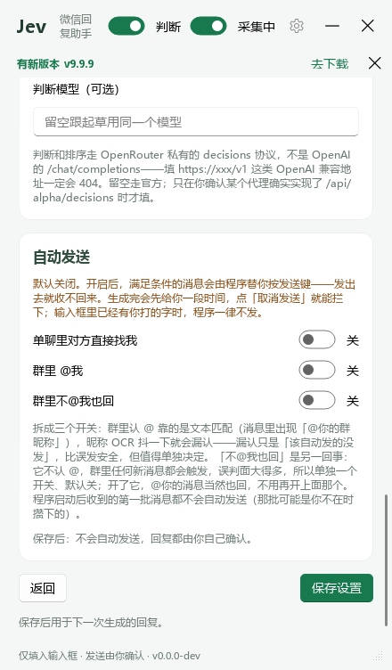
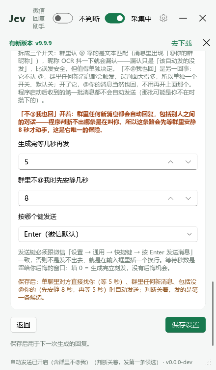
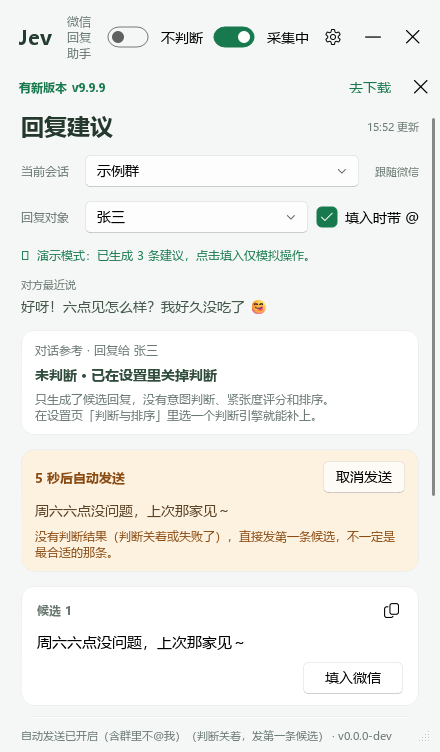
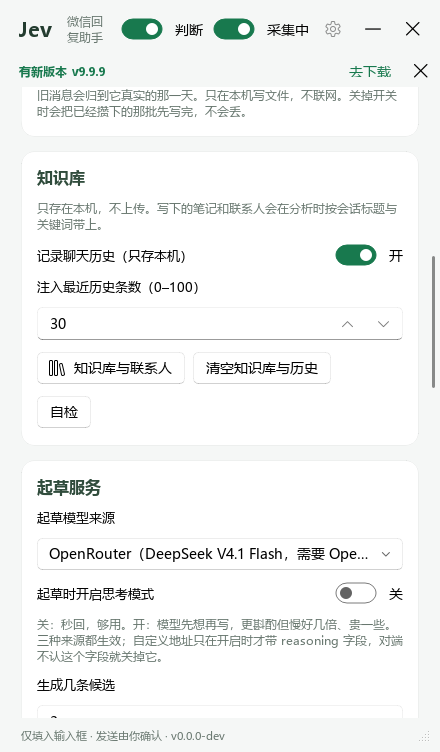
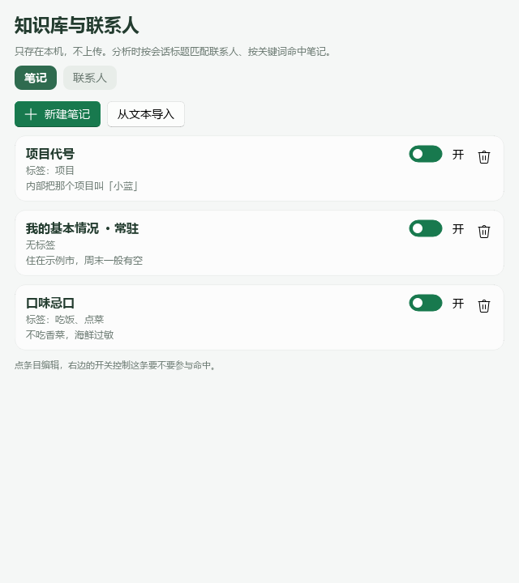

# jev-chat-windows（非官方修改版）

> Windows 上的微信助手悬浮窗：截自己屏幕上自己的微信窗口 → 本地离线 OCR 读对话 → 生成候选回复 →
> 一键填入输入框（可选自动发送）。
> **非官方修改版**，基于 [jev-chat-windows](https://github.com/jev-chat/jev-chat-windows) 二次开发。
>
> *An unofficial modified fork of [jev-chat-windows](https://github.com/jev-chat/jev-chat-windows):
> a Windows overlay that reads your own WeChat window with local OCR and drafts replies for you.*

---

## ⚠️ 先说清楚三件事

**一、这是第三方非官方修改版。**

- 本仓库**不是** [jev-chat](https://github.com/jev-chat) 的官方发行版，与原作者**无隶属关系**，
  也**未获得原作者背书**。上游明确要求：不得用「jev-chat-windows」「Jev 聊天助手」「jev-chat」名称或
  chatjevs.com 域名暗示由原作者出品或背书——所以这里第一句就写明白。
- 原始项目：
  - [jev-chat/jev-chat-windows](https://github.com/jev-chat/jev-chat-windows) —— Windows 版，MIT，
    本仓库的**直接上游**
  - [jev-chat/jev-chat-jarvis](https://github.com/jev-chat/jev-chat-jarvis) —— 安卓原版，MIT，
    Jev 判断内核和题目口径来自这里
- 本仓库在上游基础上做了修改与增补，改了什么见 [NOTICE](NOTICE) 与 [docs/CHANGELOG.md](docs/CHANGELOG.md)。
  **想要上游原版请直接去 [github.com/jev-chat/jev-chat-windows](https://github.com/jev-chat/jev-chat-windows)。**

**二、免责声明。**

- **仅供个人学习与自用。** 请遵守微信的用户协议与当地法律法规，不要用它做群发、营销、骚扰或
  任何形式的自动化滥用。用坏了、被封号、发错消息，都由使用者自己承担。
- **自动发送是不可撤回的**：微信没有撤回接口，本工具也不碰。最坏的情况是它替你回了一句你不想发的话，
  而对方已经看到了。想彻底避免就保持默认关——**出厂状态就是关的**，装了它也只把文字填进输入框。
- 本项目按 MIT 协议「按原样」提供，不附带任何形式的担保。
- 本工具**不**逆向微信协议、**不** hook 或注入微信进程、**不**读微信数据库、**不**解密聊天记录。
  它只截自己屏幕上、自己本来就有权查看的微信窗口，然后做本地离线 OCR。

**三、发布包里的界面组件是 GPLv3。**

Windows 发布包（PyInstaller 打的 zip）打包了
[PySide6-Fluent-Widgets](https://github.com/zhiyiYo/PyQt-Fluent-Widgets)，该组件是 **GPLv3**：
非商用免费，**商用需要另外购买商业授权**。因此**发布包整体受 GPLv3 约束**；只从源码运行不受这条影响
（源码本身仍是 MIT）。详见 [NOTICE](NOTICE)。

---

## 这是什么

一个常驻桌面、置顶可拖动的小悬浮窗。它做的事只有三件：

1. **看**：截取你自己的微信窗口，本地离线 OCR 认出当前会话名和消息区里的对话（谁说的、说了什么）。
2. **想**：对方来了新消息，就把最近若干条对话发给模型，生成 1~3 条候选回复。
3. **填**：你点一下「填入微信」，文字进微信输入框，光标留在那儿——**发送你自己按**。

**开了自动发送（默认关）** 之后，它才会替你按发送键；那是一个不可逆的动作，所以从开关到每一条的
门禁都写得很细，见 [自动发送](#自动发送可选默认关)。

## 和上游原版的区别

上游是「截图 + OCR → 候选 → 你手动发送」。本修改版在上游基础上加了这些（不想用新东西的话，
把对应的开关保持默认关即可，行为跟上游一致）：

| 改动 | 默认 | 说明 |
| --- | --- | --- |
| **自动发送** | 关 | 三条路可分别开关：单聊对方找我 / 群里 @我 / 群里不@我也回。发送前有可取消的倒计时，输入框里已有内容时绝不发送 |
| **群里「不@我也回」** | 关 | 群聊多一种回复方式（是**多一种**，不替换 @我），带一个「群里先安静几秒」的窗口，避免群里刷屏时插话 |
| **聊天记录导出** | 关 | 把看过的对话按 `会话名/日期.csv` 落到本地，四列 `时间/方向/发送者/内容`，区分「对方 / 我 / 程序（自动发的）」 |
| **知识库与联系人** | 历史关 | 手写笔记 + 给会话建联系人（关系 / 备注 / 别名），分析时按会话标题和关键词命中并带上；聊天历史**默认不记**。**这一档是对齐上游 v1.3 补齐的**，不是本版自创 |
| 设置项语义修正 | — | 「生成完等几秒再发」与「群里不@我时先安静几秒」的含义和界面标签对齐（上游这两个数容易读反） |
| 若干健壮性修复 | — | 重试策略、打包、倒计时串台等，见 [docs/CHANGELOG.md](docs/CHANGELOG.md) |

## 功能

- **跟着微信当前会话走**：会话名从面板头部 OCR 出来，记录、上下文、候选都按会话分开存；也可以自己
  在下拉框里选另一个会话，翻它的记录和上次的建议（那会儿只能看不能填）。
- **群聊**：每条消息前面的发言人名会一起喂给模型，所以它知道哪句是谁说的；打开「群聊指定回复对象」
  还能选回复给谁，三条候选都按 TA 写，填入时可带「@名字 」前缀（纯文本）。
- **1~3 条候选**：设置里可调，默认 3；调成 1 会少生成内容、速度更快，但没有「推荐排序」可言。
  完整模式下每条带 Jev 给的胜出概率百分比，按概率排序，推荐那条置顶并标「推荐回复」；
  自判模式下按模型给的推荐顺序排、同样标推荐，但**不显示百分比**；不判断时没有依据，卡片按生成顺序排、
  标「候选 1/2/3」。每条都有「填入微信」和复制按钮。
- **判断摘要**：建议动作、可能意图、对方可能需要、紧张度 0–9。自判和完整模式都有；自判模式的摘要下面
  会明写「由你自己的模型自评，未经校准」——分不清哪个数字有校准依据比不给数字更糟。
- **三档模式**：完整（OpenRouter，有校准概率）/ 自判（用起草模型，有摘要和排序、无概率）/ 不判断（只要候选）。
  设置里选；没填 OpenRouter key 时默认自判。**判断那一步失败也不会连候选一起丢**。
- **自动发送（默认关，本修改版新增）**：设置页可分别打开三条路，开启后生成完等 N 秒自动替你按发送键，
  N 秒内可点「取消发送」拦下。输入框里已有内容、正在看别的会话、第一批消息、群里没 @ 你——任一情况都不发。
  完整清单见[自动发送](#自动发送可选默认关)。
- **聊天记录导出（默认关，本修改版新增）**：设置页打开后，看过的对话会写进程序目录下的 `聊天记录/`，
  按 `会话名/日期.csv` 分层，四列 `时间 / 方向 / 发送者 / 内容`。详见[聊天记录导出](#聊天记录导出可选默认关)。
- **知识库与联系人（可选，本修改版新增）**：手写笔记（标题 / 正文 / 标签，可设「常驻」），给会话建联系人
  （关系 / 备注 / 别名）。分析时按会话标题匹配联系人、按标签或标题在会话标题与最近 6 条消息里命中笔记，
  命中的内容作为「背景事实」带进 prompt；聊天历史默认**不记**，打开后才会按会话存下来并回注最近 N 条。
  全部只存本机、不出网、有 1500 字硬预算。**没建知识库时行为跟加这个功能之前一个字节都不差。**
  详见[知识库与联系人](#知识库与联系人可选默认不记历史)。
- **分阶段进度**：状态栏会依次写「正在起草候选回复…」→「正在判断和排序…」，不用盯着一个不动的
  「正在生成」猜它卡在哪一步。
- **标题栏一键关判断**：拨一下就立刻生效（不用进设置页、不用点保存）。关掉就是「不判断」档——想快时最省事的一刀。
- **超时不再重试**：超时意味着「对端已经慢到超过我们愿意等的上限」，立刻再打一次几乎必然还是超时。
  5xx / 429 / 连接被掐照旧重试（那些是真的可能变好）。详见[调用失败怎么办](#调用失败怎么办自动重试)。
- **采集开关**：标题栏一拨就停，WGC 会话一起停掉（Win10 的黄框跟着消失），已有候选不受影响。
- **实时聊天记录面板**：底部展开，看 OCR 到底读出了什么，认错了一眼就能发现；**接口报错的详情也打在这里**。
- **起草模型来源可选**：OpenRouter，或 DeepSeek 直连（国内更快），或**自定义**——填任意 OpenAI 兼容的
  基础地址和模型名、配一把自己的 key。地址和模型名都在设置页改，不用动源码。
- **说话风格 / 参考上下文条数**：一句话描述自己的口吻；上下文 3~30 条可调。
- **响应式悬浮窗**：置顶、可拖可缩，最小 320×360，窄于 400 进紧凑模式。
- **新版本提示**：启动时（可关）查一次 GitHub 最新版本号，有新版本会在标题栏下面出现一条提示。

## 快速开始

### 方式一：下载打包好的版本（推荐）

**普通使用直接下载，不用装 Python、不用碰源码。**

👉 **[下载最新版](https://github.com/caizili999/jev-chat-windows/releases/latest)**

1. 在 Releases 页下载 `jev-chat-windows-vX.Y.Z.zip`
2. 解压到一个固定目录（整个文件夹一起，exe 要用旁边那堆文件）
3. 双击 `jev-chat-windows.exe`

> exe 没签名，SmartScreen 会拦一下：「更多信息」→「仍要运行」。
> 介意就往下看[自己打包](#自己打包)，自己打的更踏实。

### 方式二：从源码运行（开发者）

```bash
git clone https://github.com/caizili999/jev-chat-windows.git
cd jev-chat-windows
python -m venv .venv
.venv\Scripts\activate
pip install -r requirements.txt
python main.py
```

PyCharm / VS Code 里直接 Run `main.py` 也行。

### 环境要求

下载 exe 的只看前三条；Python 只有源码运行 / 自己打包才需要。

- **Windows 10 1903+ 或 Windows 11**（Windows Graphics Capture 的最低要求）
- **微信 Windows 4.x**（`Weixin.exe`）
- **一个起草服务的 API key**：[DeepSeek](https://platform.deepseek.com/)（推荐，国内直连）/
  [OpenRouter](https://openrouter.ai/) / 任意 OpenAI 兼容地址，三选一。判断那一步默认也用它
- **Python 3.10+**（自己打包的话）
- **OpenRouter API key**（选填）：填了才有校准过的胜出概率（完整模式）；不填走自判模式，
  照样有摘要和推荐排序

> Win10 上 WGC 会在微信窗口外画一圈黄框，系统不给关；Win11 才能关掉。
> 嫌碍眼就把标题栏的采集开关拨到「已暂停」，黄框立刻消失。

## 使用说明

### 第一次启动

1. 设置页第一张卡「起草服务」：选「起草模型来源」并填对应的 key。
   - **推荐国内用户选 DeepSeek 直连**，最省事也最快。
   - 选 OpenRouter 就要填 OpenRouter key（跟下面第二张卡共用同一把）。
   - 选「自定义」就填基础地址 + 模型名 + 自己那把 key。
2. 第二张卡「判断与排序」→「判断引擎」，三档选一个：
   - **OpenRouter（有胜出概率）**：走 Jev 内核（`typesafe/jev-1.13`，只在 OpenRouter 上有）。
     这是唯一会给校准概率的一档。
   - **用起草模型判断（默认，无概率）**：拿你刚配好的起草模型再做一次调用，给摘要、紧张度和推荐顺序。
     两个地址留空 = 跟起草完全一样，不用额外配任何东西。
   - **不判断**：只要候选回复，最省钱。
3. 选「你们的关系」（恋人 / 朋友 / 同事 / 家人 / 自定义），保存。可以用了。

保存时如果还缺东西，设置页会直接说清缺哪一格，但**不会拦着不让你存**——已经填好的地址、模型、密钥照旧写进去。

### 日常怎么用

- 微信开着、别最小化（用别的窗口盖住没事），把要聊的会话点开
- 对方来一条消息 → 悬浮窗几秒后给候选回复；开了判断还会带判断摘要和推荐顺序
- 嫌慢就拨标题栏那个「判断」开关关掉判断（只给候选），或者去设置里把「生成几条候选」调成 1
- 点「填入微信」→ 文字进微信输入框 → **你自己看一眼、改一改、按发送**。没开自动发送时程序不碰发送键
- 你在微信里切到哪个会话，悬浮窗就跟到哪个；群聊会带上发言人名
- 暂时不想让它读微信：标题栏开关拨到「已暂停」

### 国内用户建议：起草切到 DeepSeek 直连

起草候选默认走 OpenRouter，但从国内过去要等好几秒、还时不时抽风。DeepSeek 官方 API
（`api.deepseek.com`）国内直连，起草基本就是一次 HTTP 请求的时间，体感差好几倍：

1. 去 [platform.deepseek.com](https://platform.deepseek.com/) 申请一个 key（很便宜，起草一次几厘钱）
2. 设置页「起草服务」→「起草模型来源」选 **DeepSeek 直连**，填 DeepSeek key，保存

### 花多少钱

只有对方来新消息才调模型：完整模式是一次起草 + 一次 Jev 判断；自判模式也是一次起草 + 一次判断，
只是判断用的是起草那把 key；选「不判断」就只有起草那一次。**十分钟没人说话就是十分钟零调用。**
思考模式默认关，别开——起草三句话用不上，慢好几倍还贵。

## 自动发送（可选，默认关）

上面那句「发送由你确认」是出厂状态。**如果你就是想让它替你发**，设置页第三张卡「自动发送」可以打开。
这一节把边界写清楚——开了之后程序手里就有你微信的发送键，值得先读完再决定。

### 怎么开

1. 设置页 →「自动发送」卡 → **三个独立开关，默认都关**：
   - **「单聊里对方直接找我」**：对方给你发消息 → 自动回。
   - **「群里 @我」**：群里有人 @ 你 → 自动回。这个要填 **「我在群里的昵称」**——群昵称跟微信昵称
     经常不一样，程序只认你填的这一个，没填就不发（宁可漏认，不可错认）。
   - **「群里不@我也回」**（本修改版新增）：群里任何新消息都回，**包括别人之间的对话**。误判面最大，
     所以它不认 @、也不需要群昵称；开了它，@你的消息当然也回，不用再开上面那个。
2. 「生成完等几秒再发」默认 **5 秒**，范围 0~30。**三条路共用这一个值**，这几秒是给你的后悔时间。
3. 「群里不@我时先安静几秒」默认 **8 秒**，只对第三个开关生效：群里连着聊的时候它一直往后等，
   只在话题停顿处动手——不然就成「群里每有人说话都插一句」的刷屏机器人。填 0 = 不等安静。
4. 「按哪个键发送」默认 **Enter**（微信默认）。**必须跟你微信设置里的发送键一致**。
5. 保存。

### 开着的时候长什么样

每次自动发送前，候选卡片上方会出现一条橙色倒计时条：「5 秒后自动发送」+ 一颗「取消发送」按钮。
点一下就能拦下，回复留在候选里不会消失。如果你为了提速关掉判断，倒计时条、页脚和设置页会明确写
「判断关着，发第一条候选」——它仍然会发，但不会假装那是判断过的推荐。

### 它不会替你做这些（代码里逐条拦死的）

| 情况 | 为什么 |
| --- | --- |
| **程序刚启动时的第一批消息** | 你不在的时候微信攒了一批，开程序就替你回一条几小时前的消息太危险。从第二批起才生效 |
| **你在手动看别的会话 / 浏览旧会话** | 界面正显示的不是微信当前开着的会话 → 发出去就串会话了 |
| **输入框里已经有内容** | 你可能正在打字，或者上一条回复还没删。宁可漏发这一次，也不覆盖你正在写的东西 |
| **正在生成新的回复 / 微信切了会话** | 这条回复对应不上当前状态了 |
| **这一档没有判断结果**（选了「不判断」，或判断那一步失败） | **发第一条候选**，倒计时条会写明「没有判断结果，直接发第一条」，不假装它是推荐回复 |
| **群里这条没 @ 你** | 只认「@你填的昵称」，裸昵称不算（会被「他说我今天……」这类句子误伤） |

任何一条没满足，都不会静默跳过——状态栏和日志会写清是**哪个**条件拦下的，你能一眼看出是配置没对还是设计如此。

### 误判的后果，以及怎么自查

自动发送是**不可撤回**的（微信没有撤回接口，本工具也不碰）。所以：

- 程序发完 **2.5 秒会回看一眼输入框**。如果里面还有内容，说明**发送键跟你微信设置里的不是同一个**——
  文字没发出去，还堆在输入框里。状态栏会直接告诉你，看到就立刻去对一下微信
  「设置 → 通用 → 快捷键」。这是唯一能自查「发送键填错」的手段。
- 判不准一律往「有字」的方向判（宁可漏发，不可乱发）——所以偶尔会看到「输入框里已经有内容了」这种
  其实框是空的情况。这是刻意的。
- 群里靠**文本匹配**认 @，OCR 漏一个字就认不到，会漏发。@ 的识别只在「@昵称」连在一起时成立。

## 聊天记录导出（可选，默认关）

设置页第一张卡里有个 **「保存聊天记录到本地」** 开关（默认关）。打开后，程序看过的对话会写进
**程序目录下的 `聊天记录/`**，按 `会话名/日期.csv` 分层：

```
聊天记录/
  示例群/
    2026-09-24.csv
```

每个 CSV 四列：

| 时间 | 方向 | 发送者 | 内容 |
| --- | --- | --- | --- |
| 2026-09-24 14:15 | 对方 | 张三 | 今天天气不错 |
| 2026-09-24 14:16 | 我 | | 那我们去哪 |
| 2026-09-24 14:16 | 程序 | | 去爬香山 |

**「方向」分 `对方` / `我` / `程序`**——程序替你自动发出去的那条会单独标出来，事后翻记录才分得清
哪句是你自己打的、哪句是它替你发的。

细节：

- **时间是聊天时间，不是「你看到它的时间」**：从微信里那行灰色时间戳认出来的
  （`14:15` / `昨天 14:15` / `星期二 14:15` / `9月20日 14:15`），认不出一律留空并继承上一条已知时间——
  **宁可留空也不猜**，猜错会把消息归到错的日期里。一条都认不到才退回当前时间，并会在聊天记录面板里说破。
- **去重是「宁可漏掉，不可写错」**：最近 50 条内查重，连 OCR 抖动认错一个字也算同一条；
  程序重启后会读回已写的文件接着查，不会把整屏重报的旧消息写第二遍。窗口外的同内容照记——
  同一个人两次说「好的」是两条真实消息，不该被吞。
- **切换会话就以进入那个会话的时刻为新起点**；切进去时屏幕上已经显示的那几条会一起记下来
  （程序分不出它们是不是刚到的）。
- **攒批落盘**：攒够 20 条或满 5 秒写一次，退出时再写一次，所以被强杀最多丢最后几秒。
- **写盘失败只在「聊天记录」面板报一行**，绝不影响采集、生成和自动发送。
- 会话名会转义成合法目录名（Windows 非法字符、`CON` 这类保留名、超长名字带哈希防撞名）。
- **只在本机写文件，不联网。** 关掉开关时会先把攒下的那批写完再停。那个目录已在 `.gitignore` 里，
  你自己的对话内容不会被误提交。

## 知识库与联系人（可选，默认不记历史）

上游 Jarvis 的那套「记住这个人是谁、记住这些事实」。Windows 这边整块都是**可选**的：
什么都不建就跟以前完全一样。

设置页「知识库」那张卡里有两个入口：「知识库与联系人」打开管理窗口，「清空知识库与历史」一次删干净。

**笔记**（管理窗口第一个页签）

- 标题 + 正文 + 标签，另有「启用」和「常驻」两个开关。
- **命中规则**：任一标签或标题出现在**会话标题**里、或出现在**最近 6 条消息**里，这条笔记就带上。
  最多带 5 条命中的，越新的越优先。
- **常驻**的笔记不看关键词，每次都带上——适合「我自己的固定情况」这类前提。
- 「从文本导入」可以一次贴一段：按空行分段，每段第一行当标题、其余当正文。

**联系人**（管理窗口第二个页签）

- 名字 + 别名（每行一个）+ 关系 + 备注。
- **命中规则**：会话标题等于名字或任一别名即算命中，**忽略大小写、忽略群人数后缀、忽略零宽字符**。
  所以 `测试群(12)`、`测试群（12）`、`  测试群  ` 会认成同一个人。别名可以填别的写法或群名。
- 关系填了会作为「关系：…」带进分析，**优先于设置页那个全局「关系背景」**；备注当作关于这个人的事实。
- 联系人**只由你建立**，程序不会自动创建。想快速建一个：在回复建议页点「存为联系人」，
  把界面上正看着的会话一键存下来（已存在就并入）。
- 每个联系人可以单独「清空此人历史」，删联系人的话历史一起删。

**聊天历史（默认关）**

- 设置页「记录聊天历史（只存本机）」打开后，才会把聊天按会话存进 `知识库/logs/`，并在分析时回注
  **最近 N 条**（N 在下面那格填，0~100，默认 30）。
- **0 是合法值**：只记录、不注入。这种组合界面会明确提示一句，不然两个控件各自看都正常，
  凑一起才「记了却永远不带」。
- 回注时**会把已经显示在屏幕上的那几条去掉**——它们本来就在上下文里，重复带一份只是白占预算。
  所以如果一个会话的历史**全都还显示在你当前屏幕上**，这一轮就一条都不会带（这是正常的，不是坏了；
  把聊天往上滚一屏，或者等新消息把旧的顶出去，历史就会开始生效）。
- 首页那行报的是**这一轮实际注入了几条**，不是日志里存了多少。它会随着聊天慢慢涨，
  **涨到上面填的那个数（默认 30）就封顶不再涨**——那是注入上限，不是又卡住了。日志本身最多留 300 条。
- 每个会话只留最近 300 条。

**预算与边界**

- 笔记 + 历史加起来不超过 **1500 字**。超了先丢最旧的历史，再整条丢笔记（**绝不截半条**）；
  常驻笔记不参与裁剪。
- 全是**精确匹配 + 纯子串**，没有 embedding、没有打分，不出网、不调模型。
- 内容只存在程序目录下的 `知识库/`，跟 `config.json` 同级——整个文件夹拷走知识库也跟着走。
  那个目录在 `.gitignore` 里。
- 设置页那张卡里还有个低调的「自检」按钮：用临时数据跑一遍匹配、命中和去重，跑完把自己造的东西删掉。
  它是排查用的，不是功能。
- **首页状态栏下面那行会写「本轮已带上：N 条笔记、M 条历史」**（带上了联系人关系/备注时会再补一句「、联系人背景」）——
  开了知识库之后，这是唯一能当场确认「真的用上了」的地方。什么都没识别到时写「本轮未使用知识库」；
  识别到联系人了、但这一轮确实没有可补的内容（比如那些记录全都还显示在你当前屏幕上，见上面「聊天历史」那段），
  写的是「本轮已识别到联系人，但没有可补的内容」——**不会**说成「未使用」，免得你以为功能坏了。

**出网范围会变**：知识库命中时，联系人关系 / 备注 / 笔记正文 / 历史会随对话一起发给模型——
它们就在 prompt 里（详见[隐私与边界](#隐私与边界)）。所以笔记里**别写密钥、密码、身份证号**这类东西。

## 设置说明

| 设置项 | 说明 | 存在哪 |
| --- | --- | --- |
| 关系背景 | 决定说话的分寸。恋人 / 朋友 / 同事 / 家人，或自己填一句 | `config.json` → `relationship` |
| 说话风格 | 一句话描述自己的口吻，补在「照着你最近发的消息模仿」之上 | `config.json` → `style` |
| 参考上下文条数 | 3~30，默认 10，起草和判断都按它取最近 N 条 | `config.json` → `context` |
| 群聊指定回复对象 | 开了以后群聊里可以选回复给谁，候选针对 TA 写，填入时可带「@名字 」前缀 | `config.json` → `reply_target` |
| 起草模型来源 | OpenRouter / DeepSeek 直连 / 自定义（任意 OpenAI 兼容地址） | `config.json` → `draft_provider` |
| 基础地址（自定义） | 填到 `/v1` 即可，程序自己补 `/chat/completions` | `config.json` → `draft_base_url` |
| 模型名（自定义） | 留空用该地址的默认模型 | `config.json` → `draft_model` |
| 判断引擎 | 完整（OpenRouter，有校准概率）/ 自判（用起草模型，有摘要和排序、无概率）/ 不判断 | `config.json` → `judge_engine` |
| 判断服务地址 / 模型（可选） | **走哪条协议跟着引擎变**：完整模式只能填 OpenRouter 兼容代理；自判模式填任意 OpenAI 兼容地址 | `config.json` → `judge_base_url` / `judge_model` |
| 起草时开启思考模式 | 开了模型先想再写，慢好几倍、贵一些 | `config.json` → `thinking` |
| 失败后最多再试几次 | `0~5`，默认 2。5xx / 408 / 429 / 连接被掐 / 响应体格式不对才重试，4xx **和超时**都不重试 | `config.json` → `retries` |
| 启动时检查更新 | 开了才在启动时查一次 GitHub 最新版本号 | `config.json` → `check_update`（默认开） |
| 保存聊天记录到本地 | 开了才把看过的对话写进「聊天记录」目录。**默认关**：它要长期往磁盘写文件 | `config.json` → `save_history`（默认关） |
| 起草超时 / 判断超时（秒） | `5~120`，默认 20 / 15。判断超时**不丢候选**，只是没有摘要和排序 | `config.json` → `draft_timeout` / `judge_timeout` |
| 生成几条候选 | `1~3`，默认 **3**。**调小能真变快** | `config.json` → `candidate_count` |
| 单聊里对方直接找我（自动发送） | 单聊里对方给你发消息 → 生成完等 N 秒自动发送。**默认关** | `config.json` → `auto_send_dm` |
| 群里 @我（自动发送） | 只有**明确 @你填的昵称**的消息才自动发送。**默认关**，且必须填下面的群昵称 | `config.json` → `auto_send_group` |
| 群里不@我也回（自动发送） | 群里**任何新消息**都自动发送，**包含**上面那个开关。**默认关** | `config.json` → `auto_send_group_any` |
| 生成完等几秒再发 | 自动发送前的可取消倒计时，`0~30`，默认 **5**。三条路共用这一个值 | `config.json` → `auto_send_delay` |
| 群里不@我时先安静几秒 | 只对「不@我也回」生效，`0~30`，默认 **8**；填 0 = 不等 | `config.json` → `auto_send_any_wait` |
| 按哪个键发送 | Enter（微信默认）/ Ctrl+Enter。**必须跟你微信「设置 → 通用 → 快捷键」里的选择一致** | `config.json` → `send_key` |
| 我在群里的昵称 | 判断「有没有 @我」用的名字，要填群里显示的那个 | `config.json` → `my_name` |
| 记录聊天历史（知识库） | 开了才把聊天按会话记进 `知识库/logs/` 并回注。**默认关**：它要长期往磁盘写聊天内容 | `config.json` → `kb_history_enabled`（默认关） |
| 注入最近历史条数（知识库） | `0~100`，默认 **30**。**0 是合法值**（只记录、不注入），界面会明确提示这种组合 | `config.json` → `kb_history_count` |
| API 密钥 | 四个 key 都**只进注册表** `HKCU\Environment`，任何文件里都不出现，也绝不进日志；注册表里存的是 **DPAPI 密文**（只有同一个 Windows 用户能解开） | 注册表 → `OPENROUTER_API_KEY` / `DEEPSEEK_API_KEY` / `CUSTOM_API_KEY` / `JUDGE_API_KEY` |

保存时只校验格式（地址要 `http://` / `https://` 开头），**不拦「还没填 key」**——不然刚填的地址和模型会一起丢掉。
缺什么由保存后那条提示统一说。

## 界面说明

- **当前会话**：顶部下拉框，自动跟着微信走（右边标「跟随微信」）。聊天记录、喂给模型的上下文和候选
  都按会话分开，切来切去不串味。也可以自己选另一个会话翻它的记录和上次的建议（标「浏览中」）——
  那会儿只能看不能填，微信当前开着的不是它，填进去就串会话了。
- **回复对象（群聊，可选）**：设置里打开「群聊指定回复对象」后，群聊的「当前会话」下面会多一行下拉框，
  选回复给谁，三条候选就都按 TA 来写（换一个人会立刻重生成）。旁边的「填入时带 @」默认勾着，填入时会
  在开头加「@名字 」——那只是普通文字，微信不会认成真正的 @（真 @ 得用微信自己的选人面板）。
- **采集开关**：标题栏右上角。拨到「已暂停」就完全不读微信（WGC 会话一起停掉，黄框也没了），
  已经生成的候选照样能填入、能复制。
- **判断开关**：标题栏上、紧挨着「采集开关」。拨一下立刻生效（不用进设置页、不用点保存）。
  它跟设置页的「判断引擎」是**同一个设置**，两处显示永远一致。
- **填入微信**：点候选卡片上的「填入微信」，文字进微信输入框，光标留在那儿，**发送你自己按**。
- **自动发送倒计时条**：开了自动发送时，候选上方会出现橙色条「N 秒后自动发送」+「取消发送」。
  倒计时结束前你手动点「填入微信」，也会自动取消这一次自动发送。
- **复制**：卡片右上角的复制按钮。
- **聊天记录**：底部按钮展开，看 OCR 到底读出了什么。**接口报错的详情也打在这里**
  （和 OCR 文本同一个面板，这是已知的将就之处）。
- **状态栏的失败提示**：认得出 HTTP 状态码就给一句能照做的，例如 `403 被该地址的防护拦下了（不是密钥问题）`、
  `401 密钥被拒，检查这个地址对应的 key`、`404 地址路径不对，确认要不要带 /v1`；重试过还会带上次数。
  **失败时「聊天记录」面板会自动展开，真因就在第一行。**

几个注意：

- **微信别最小化。** Windows 不渲染最小化窗口，什么截图法都拿不到画面。程序发现被最小化会无激活还原
  再压到最底下（不抢焦点），但直接用别的窗口盖住微信是更省心的做法——被遮挡不影响 WGC。
- **群聊和单聊各算一个会话**（群名后面的成员数「(422)」会去掉，只拿名字当 key）。
- **判断题的口径是按一对一写的**，群里多人混说时结论会偏。

## 截图

界面全部是合成演示数据（`tools/preview_ui.py` 生成，不含任何真实聊天内容）。

<table>
<tr>
<td width="25%"></td>
<td width="25%"></td>
<td width="25%"></td>
<td width="25%"></td>
</tr>
<tr>
<td align="center">回复建议（完整模式）：「当前会话」跟随微信、群聊多一行「回复对象」，3 条候选带 Jev 概率百分比，推荐那条置顶</td>
<td align="center">回复建议（自判模式）：有摘要和推荐顺序，卡片<b>不带百分比</b>，并写明「自评未经校准」</td>
<td align="center">设置：关系背景、说话风格、参考上下文条数、群聊指定回复对象</td>
<td align="center">采集暂停：不再读微信，已有候选照样能填入、能复制</td>
</tr>
</table>

<table>
<tr>
<td width="25%"></td>
<td width="25%"></td>
<td width="25%"></td>
<td width="25%"></td>
</tr>
<tr>
<td align="center">自动发送：三个开关 + 共用的倒计时秒数 +「不@我也回」专属的安静窗口</td>
<td align="center">橙色倒计时条：「5 秒后自动发送」+「取消发送」</td>
<td align="center">保存聊天记录到本地：开关 + 存放位置（只读，可直接复制）</td>
<td align="center">「判断与排序」卡：完整 / 自判 / 不判断三档</td>
</tr>
</table>

<table>
<tr>
<td width="50%"></td>
<td width="50%"></td>
</tr>
<tr>
<td align="center">关掉判断后的自动发送设置：「发第一条候选」写死在卡片上</td>
<td align="center">关掉判断后的倒计时条：同样写明「没有判断结果，直接发第一条」，不假装它是推荐回复</td>
</tr>
</table>

判断关闭时，设置页和倒计时条都会明确写「发第一条候选」——它仍然会发，但不假装那是判断过的推荐。

<table>
<tr>
<td width="50%"></td>
<td width="50%"></td>
</tr>
<tr>
<td align="center">知识库：记录聊天历史的开关 + 注入条数，两个入口和一个低调的「自检」</td>
<td align="center">知识库与联系人：笔记（标签 + 启用开关）和联系人两个页签，点条目编辑</td>
</tr>
</table>

知识库整块是可选的：不建任何东西时，设置页这张卡、首页那行计数和「存为联系人」按钮都不会出现，
行为跟没有这个功能完全一样。（上面两张图用 `tools/preview_ui.py --kb` / `--kb-window` 生成，
演示数据建在临时目录里。）

## 隐私与边界

这是个人自用工具，下面几条是硬约束，代码里就是这么写的：

- **只读自己电脑上、自己本来就有权查看的对话。** 不代替任何人查看别人的聊天。
- **只截自己的微信窗口 + 本地离线 OCR（RapidOCR）。** 不 hook、不注入、不读微信数据库、不解密、
  不碰微信进程内存。
- **截图只在内存里。** 捕获到的帧是 numpy 数组，全程不写磁盘、不进日志、不上传，程序里没有 `.save()`。
  **唯一的例外是「保存聊天记录到本地」**（默认关）：打开后写出去的是 **OCR 认出来的文字**，不是截图，
  而且只落在你自己机器上的 `聊天记录/` 目录里，不上传、不发给任何服务。那个目录也在 `.gitignore` 里。
- **知识库只存在本机，但命中时会随请求发出去。** 你手写的笔记、联系人备注、别名，以及（默认关的）
  聊天历史，都存在程序目录下的 `知识库/`，不上传、不同步、不发给任何服务。**但要清楚**：命中时它们
  会作为 prompt 的一部分发给模型——这跟对话文本本身是同一条通道。所以笔记里别写密钥、密码、身份证号
  这类东西。那个目录也在 `.gitignore` 里。
- **默认不自动发送。** 出厂状态下只把文字粘进输入框就停手，不发回车、不点发送按钮；页脚一直写着
  「发送由你确认」。只有你在设置页显式打开「自动发送」之后才会替你按发送，而且**默认只对单聊里直接找你的
  消息、以及群里 @ 你的消息**生效——别人的群聊闲话不会替你回（「不@我也回」是单独的开关，默认关）。
- **不碰钱。** 转账、红包、收款相关的界面元素一律不碰，起草的 system prompt 里也禁了这几个话题。
- **只有对方的新消息到来（或你在群里换了回复对象）才调一次模型。** 静默期零调用——十分钟没人说话
  就是十分钟零 token。
- **API key 只进环境变量，且注册表里是密文。** 四个 key 都写进注册表 `HKCU\Environment`
  （跟 `setx` 同一个地方），任何文件里都不出现 key，也绝不进日志（报错文本一律脱敏）。
  注册表里存的值是 **Windows DPAPI 加密后的密文**（`CryptProtectData`），只能被**同一个
  Windows 用户**解开——注册表快照、备份、截图、别的账户都读不出明文。诚实说清边界：
  它挡的是「密钥以明文躺在那里被顺手拿走」，挡不住「已经以你的身份在运行的恶意程序」
  （那种情况下它本来也能读注册表）。进程内存里仍然是明文，因为 `core/` 那层只认环境变量。
- **自定义地址会改变出网范围。** 地址本身不是密钥，落在 `config.json`；但填了它，对话文本就发到那里。
  两个地址都留空时，出网范围跟以前完全一样。
- **启动时查一次版本号（可关）。** 只向 GitHub Releases API 发一个 GET，带的只有 UA 和当前版本号，
  不夹带任何聊天内容。

什么会出网：`core/` 那两次调用（起草 + 判断/排序；**选「不判断」时只有起草这一次**），加上启动时（可关）
一次到 GitHub 查版本号。**自动发送和聊天记录导出都不新增任何出网调用**——前者只是按发送键，后者只写本地文件。

`core/` 送出去的是**最近 N 条对话文本**（N = 设置里的「参考上下文」，默认 10；群聊带发言人名）、
**关系设置**、**你自己最近 12 条 60 字以内的短消息**（当口吻样本，链接和长段不送）、**你填的说话
风格**，群聊指定了回复对象的话再加一个对象名。判断那一步只看最近 6 条。
**建了知识库的话，再加上命中的笔记正文、命中的联系人关系与备注、以及（打开历史时）回注的那几条
历史**——加起来不超过 1500 字。**没建知识库时，这一项一个字节都不多。**
请求头里固定带一个 `User-Agent: jev-chat-windows`（不伪装浏览器，就一个自家标识）。除此之外没有别的。
OCR 全程离线。

**但你在设置里填了自定义地址，这条承诺就变了**：起草的对话文本会发到你填的那个地址，「判断服务地址」
填了的话判断文本也会发到那里。两个都留空时，出网范围就还是上面那三处。**改地址等于改承诺**，
请自己确认那个地址是你信任的。

## 调用失败怎么办（自动重试）

中转站、网关、家宽抖动，这些都不是你的错，也不该让你手忙脚乱地点第二次。所以起草和判断这两次出网调用
都会自动重试：

- **会重试**：`5xx`、`408`、`429`、连接被掐断、响应体不是预期格式。退避 1s / 2s / 4s，最多 4 秒一次。
- **不会重试**：`4xx`（密钥错、地址错这类——重试一百次也是同样的错），以及**我们自己等待超时**。
  超时的含义是「对端已经慢到超过我们愿意等的上限」，立刻再打一次几乎必然还是超时，中间那几秒退避等的是空气。
- 次数在设置里改（`0~5`，默认再试 2 次），起草和判断共用。

失败时状态栏给一句能照做的提示（认得出状态码就写具体原因，认不出才退回笼统的「请检查网络和服务设置」），
完整详情永远打在「聊天记录」面板第一行，那个面板会自动展开。

## 已知限制

- **自动发送是不可撤回的**：最坏的情况是它替你回了一句你不想发的话，而对方已经看到了。
  想彻底避免就保持默认关。
- **自动发送的发送键必须与微信设置一致**：设置页选了 `Ctrl+Enter` 但微信里是「按 Enter 发送」，
  文字就只会堆在输入框里发不出去（不会误发别的东西）。程序发完 2.5 秒会回看输入框并当场提示。
- **群里认 @ 靠文本匹配，会漏认**：只认「@你填的群昵称」连在一起出现，且 OCR 漏一个字就认不到。
  这是刻意的（宁可漏认，不可错认）。
- **输入框内容检测判不准时一律当「有字」**：所以偶尔会在框其实空着的时候报「输入框里已经有内容了」
  而不发。漏发可以补，覆盖你正在写的字不行。
- **导出的 CSV 是「程序看到的东西」，不是微信原文**：OCR 认错的字会原样落盘（所以它同时是排查 OCR 的
  样本）；时间戳只在屏幕上出现时才有，滚过去的那些靠继承上一条。
- **同一人连发两句一模一样的会吞一条**：去重按文本相似度做的。对「要不要触发分析」没影响，
  但**导出的 CSV 会跟着少一条**——这是「宁可漏掉，不可写错」的代价。
- **群聊里名字行被 OCR 漏识，这条消息会挂到上一个人头上**；「填入时带 @」加的 `@名字 ` 也只是纯文本，
  微信不会把它变成真正的 @ 提醒。
- **会话靠头部标题认**：OCR 抖一个字会按相似度归到已知会话（不然一抖就多出一个会话），
  代价是名字只差一个字的两个会话会被并成一个。头部一直认不出就先挂在「当前会话」名下。
- **Win10 黄框**：WGC 的采集提示框，系统不给关，Win11 才行。
- **输入框拉高超过面板一半会认错消息区**：消息区靠「面板 45% 高度以下第一根分隔线」定位。
- **OCR 的「文字必须落在平底色上」规则只对精确像素的帧成立**：缩放或压缩过的图（比如拿预览窗再截一次）
  底色会糊成几百种颜色，整屏都会被当成图片。
- **`fill` 靠点击输入框坐标**：算的是消息区底线下方 40px、左边界右侧 60px，微信改布局就得跟着调。
- **没有托盘**：关窗口就是退出（标题栏的「最小化」是收到任务栏，不是后台常驻）。
- **校准概率没有替代品**：`typesafe/jev-1.13` 只在 OpenRouter 上，走的是它私有的 decisions 协议。
  没有 OpenRouter key 就是自判模式——摘要、紧张度和推荐顺序都有，但**没有胜出概率**：
  普通模型自评的百分比没有校准依据，给出来就是假信息。
- **自判模式的结论比完整模式糙**：判断比起草难得多，用一个小模型去判断，结论会偏。
- **有些中转站会拦「不是浏览器」的请求**：Cloudflare 的默认规则里有 `Python-urllib` 这一条，所以
  Python 的 urllib 如果不显式设 User-Agent 会被直接 403（body 是 `error code: 1010`）——同一个请求
  用 curl 却是 200，很容易误判成「密钥/地址填错了」。程序现在所有出网请求都固定带
  `User-Agent: jev-chat-windows`。

## 自己打包

双击 `build.bat`（走 uv：没有 `.venv` 会自己建一个，依赖从清华镜像装、顺带装上 PyInstaller，
最后调 PyInstaller，一路到底），或者手动：

```bash
uv venv .venv --python 3.11
uv pip install --python .venv\Scripts\python.exe -i https://pypi.tuna.tsinghua.edu.cn/simple -r requirements.txt pyinstaller
.venv\Scripts\python.exe -m PyInstaller --noconfirm --clean jev.spec
```

推 `v*` tag 会触发 GitHub Actions 在 windows 上全新构建并挂到 Release
（见 [.github/workflows/release.yml](.github/workflows/release.yml)）。那条流水线会先把下面那批离线检查
跑一遍，再打包，最后**体检发布包**——确认里面没有 `config.json` / `聊天记录` 这类你自己的东西，
而且 OCR 模型、`windows_capture`、界面资源都在。**发布包只从 CI 出**：本地 `dist/` 是你自己跑过的目录，
里面有你的设置，别手动压了往上传。

本地想自己过一遍同一套体检：

```bash
python tools/check_release_bundle.py            # 体检 dist/jev-chat-windows
python tools/check_release_bundle.py --expect-version 1.2.3   # 顺带断言版本号盖过章
```

## 开发者

- **[docs/DESIGN.md](docs/DESIGN.md)** —— 工作原理（截图 → 定位 → OCR → 去重 → 调用链的完整流程图）、
  模型与判断三档、为什么走 OCR、为什么起草不那么像 AI、项目结构与每个模块的取舍
- **[docs/CHANGELOG.md](docs/CHANGELOG.md)** —— 完整迭代记录
- **[docs/KICKOFF.md](docs/KICKOFF.md)** —— 最初的需求与硬约束
- `tools/` 里有一批**离线回归检查**（不需要 Qt、不联网、不碰真实微信），跑全部：

  ```bash
  # 发现式：tools/check_*.py 全部跑一遍。新增检查脚本不用改任何清单。
  # check_release_bundle.py 要读 dist/ 构建产物，单独跑（见下）。
  for f in tools/check_*.py; do
    case "$f" in */check_release_bundle.py) continue ;; esac
    QT_QPA_PLATFORM=offscreen python "$f" || echo "FAIL $f"; done
  ```

  其中 `check_ui_layout` / `check_overlay_runtime` / `check_kb_ui` 需要 PySide6，其余不需要。
- `tools/check_release_bundle.py` 体检发布包（没有你的 `config.json` / `聊天记录`，关键载荷齐全）；
  `tools/set_version.py` 把版本号写进 `app/version.py`（CI 打包前用它盖章，本地也能跑）。
- `tools/preview_ui.py` 用合成数据预览界面，不采集不联网不碰微信；`--screenshot` 出图（README 里那几张就是它出的）。
- `probe/` 是一次性技术探针（结论已写进 docs/DESIGN.md），留着是为了可复现。

## 许可与致谢

本项目以 **MIT** 协议开源，见 [LICENSE](LICENSE)。

### 致谢（上游）

本仓库是在下列项目基础上修改而来，版权与许可声明均已原样保留（详见 [NOTICE](NOTICE)）：

- **[jev-chat/jev-chat-windows](https://github.com/jev-chat/jev-chat-windows)** —— Windows 版本体，
  本仓库的**直接上游**。MIT，Copyright (c) 2026 rezoch340 and the jev-chat contributors。
  **本项目基于它二次开发。**
- **[jev-chat/jev-chat-jarvis](https://github.com/jev-chat/jev-chat-jarvis)** —— 安卓原版，
  Jev 判断内核与题目口径都来自这里。MIT，Copyright (c) 2026 Finderchangchang and the
  jev-chat contributors。

感谢两个项目的作者和贡献者。**再次说明：本仓库是第三方修改版，不代表上游，也未获得上游背书。**

### 第三方组件

| 组件 | 许可证 |
| --- | --- |
| [PySide6-Fluent-Widgets](https://github.com/zhiyiYo/PyQt-Fluent-Widgets) | **GPLv3**（非商用免费，商用需另购授权） |
| PySide6 | LGPL-3.0 |
| [RapidOCR](https://github.com/RapidAI/RapidOCR) | Apache-2.0 |
| [windows-capture](https://github.com/NiiightmareXD/windows-capture) | MIT |
| numpy | BSD-3-Clause |
| pillow | MIT-CMU |
| PyInstaller | GPL-2.0-or-later（含 bootloader 例外） |

**发布包整体受 GPLv3 约束**（因为打包了 PySide6-Fluent-Widgets）；只从源码运行不受这条影响。
完整说明见 [NOTICE](NOTICE)。
